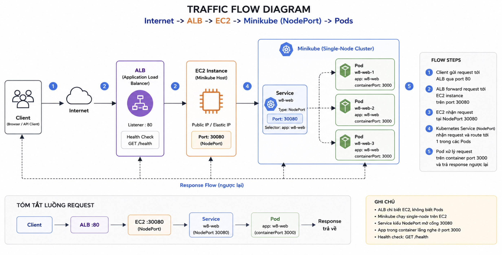

# Evidence

Folder này là phần "nói có sách, mách có ảnh" cho `W8 Project`.

Mục tiêu của bộ evidence không chỉ là cho thấy lab chạy được, mà còn chứng minh đúng các ý người chấm cần:

- Kiến trúc request flow được hiểu rõ và mô tả được
- App mở được từ URL của `ALB`
- App thật sự chạy trong `Kubernetes`
- Hạ tầng được dựng bằng `Terraform`
- Sau khi demo xong có thể `destroy` sạch

## Kiến trúc tổng thể

Trước khi đi vào từng ảnh kết quả, ảnh kiến trúc dưới đây chốt luôn đường đi của request trong bài này:

`Internet -> ALB:80 -> EC2:30080 -> Minikube NodePort Service -> Pods:3000`

- `ALB` là điểm public-facing nhận request từ Internet.
- `ALB` forward traffic tới `EC2` backend ở port `30080`.
- Trên `EC2`, `Minikube` đang chạy single-node cluster.
- Trong cluster, `Service` kiểu `NodePort` nhận traffic ở `30080`.
- `Service` route tiếp vào một trong các `Pod` có label `app: w8-web`.
- Container trong Pod thực sự lắng nghe ở port `3000`.



`Ảnh này là bản đồ tổng thể của toàn bộ luồng request, giúp đọc các ảnh evidence còn lại đúng ngữ cảnh kỹ thuật.`

## Cách đọc bộ ảnh

Thứ tự hợp lý nhất để trình bày là:

1. `architect.png`
2. `applyOutput.png`
3. `home.png`
4. `deployment.png`
5. `pods.png`
6. `service.png`
7. `destroy.png`

Đi theo thứ tự này thì câu chuyện rất rõ:

`Hiểu kiến trúc -> Terraform dựng hạ tầng -> ALB mở được app -> app nằm trong K8s -> traffic đi qua Service -> cuối cùng dọn sạch`

## Giải thích từng ảnh

### 1. Architecture

- Ảnh này mô tả đúng kiến trúc runtime của bài làm.
- Điểm quan trọng nhất là luồng `ALB -> EC2:30080 -> Service NodePort -> Pods:3000`.
- Nó cũng làm rõ một ý rất hay bị hỏi lại: `ALB` không gọi thẳng vào Pod, mà gọi vào `EC2` backend port `30080`, rồi `Kubernetes Service` mới route tiếp vào Pod.


`Đây là sơ đồ kiến trúc tổng thể dùng để giải thích đường đi request và vị trí của ALB, EC2, Minikube, Service và Pods trong cùng một flow.`

### 2. Apply Output

- Ảnh này cho thấy `terraform apply` đã chạy xong và trả ra output cần thiết.
- Điểm quan trọng nhất là phải nhìn thấy được các output như `alb_dns_name`, `ec2_public_ip`, `ssh_command`.
- Đây là bằng chứng cho việc hạ tầng không dựng tay, mà được tạo từ Terraform config.


`Đây là output sau apply, tức toàn bộ VPC, EC2, ALB và phần bootstrap đã được Terraform dựng xong.`

### 3. Home

- Ảnh này là cú chốt phần frontend: mở URL từ `alb_dns_name` trên browser và app trả về trang thành công.
- Nó chứng minh acceptance quan trọng nhất: từ hạ tầng vừa dựng lên, người dùng ngoài internet truy cập được app qua `ALB`.


`Ảnh này chứng minh URL của ALB hoạt động và request đã đi xuyên qua hạ tầng tới ứng dụng.`

### 4. Deployment

- Ảnh này cho thấy trong namespace `w8-demo` có `Deployment` của ứng dụng.
- Điểm cần nhấn là app đang được quản lý bởi Kubernetes object, không phải chỉ chạy bằng `node server.js` trên EC2.


`Ở đây ứng dụng được deploy dưới dạng Kubernetes Deployment, tức là đang chạy trong cluster minikube.`

### 5. Pods

- Ảnh này là bằng chứng trực diện nhất cho việc app đang chạy trong K8s.
- Nếu nhìn thấy nhiều pod `Running`, đặc biệt là đủ số replicas mong muốn, thì đây là dấu hiệu hệ workload đã lên đầy đủ.
- Ảnh này giúp trả lời rất nhanh câu hỏi: `Có chắc app không chạy thẳng trên EC2 không?`


`Các pod đang ở trạng thái Running, nên app thực sự đang chạy trong Kubernetes chứ không phải cài trực tiếp trên máy EC2.`

### 6. Service

- Ảnh này nối phần kỹ thuật mạng lại với nhau.
- Nó cho thấy app được expose bằng `Service` kiểu `NodePort`, chính là điểm mà `ALB` forward traffic vào.
- Nói cách khác, đây là mắt xích giải thích đường đi `ALB -> EC2:30080 -> Service -> Pods`.


`Service NodePort là cầu nối giữa ALB bên ngoài và các pod bên trong cluster.`

### 7. Destroy

- Ảnh này chứng minh bài làm không chỉ dựng được mà còn dọn được.
- Đây là phần nhiều người hay quên, nhưng lại rất quan trọng vì rubric có yêu cầu cleanup sạch sau khi xong.


`Sau khi hoàn tất kiểm tra, mình destroy lại toàn bộ để chứng minh hạ tầng này có thể quản lý vòng đời trọn vẹn bằng Terraform.`

## Mapping Với Acceptance

`1 lệnh từ repo sạch -> app chạy, URL ALB trả về trang app`

- Chứng minh bằng `applyOutput.png` và `home.png`

`App thực sự chạy trong K8s, không phải cài thẳng EC2`

- Chứng minh bằng `deployment.png`, `pods.png`, `service.png`

`Giải thích được kiến trúc request flow`

- Chứng minh bằng `architect.png`, kết hợp với `service.png`

`Có >=2 provider được wire trong cùng cấu hình`

- Chứng minh bằng code trong `infra/aws`, hiện đang wire `aws`, `tls`, `local`, `cloudinit`

`Giải thích được vì sao chọn cách làm đó`

Lab này dùng nhiều provider trong cùng một cấu hình và chúng được wire với nhau như sau:

- `tls`: tạo SSH key pair bằng `tls_private_key`.
- `local`: ghi private key ra máy local bằng `local_sensitive_file`.
- `aws`: tạo `aws_key_pair` từ public key vừa sinh, sau đó gắn key pair này vào EC2 và dựng toàn bộ hạ tầng AWS.
- `cloudinit`: render `user_data` cho EC2 từ shell template, giúp bootstrap `minikube`, pull image từ ECR và apply workload Kubernetes.

Flow thực tế:

```text
tls_private_key
  -> local_sensitive_file
  -> aws_key_pair
  -> aws_instance

template shell script
  -> cloudinit_config
  -> aws_instance.user_data
```

Vì sao chọn cách này:

- Không cần tạo sẵn key pair thủ công trên AWS.
- `user_data` vẫn đọc dễ như shell script, nhưng được `cloudinit` render nhất quán.
- Toàn bộ lab có thể dựng lại từ đầu với cùng một Terraform config.

`Dọn được sạch sau khi xong`

- Chứng minh bằng `destroy.png`
