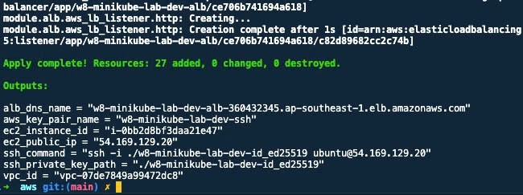
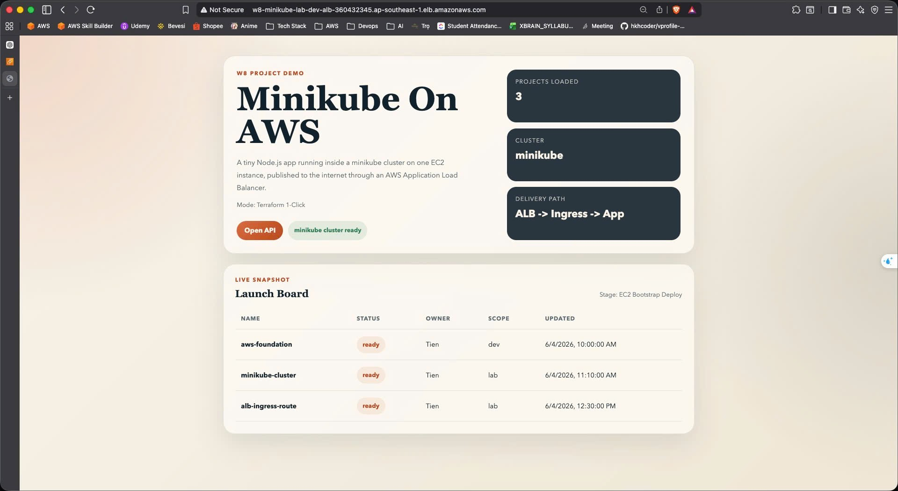
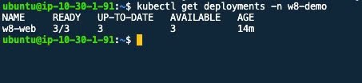
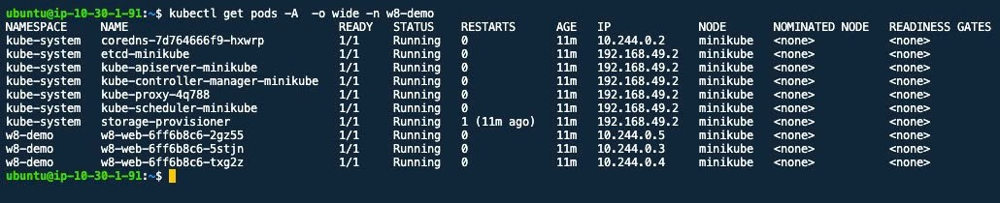
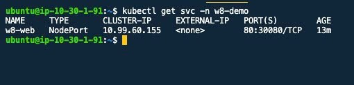
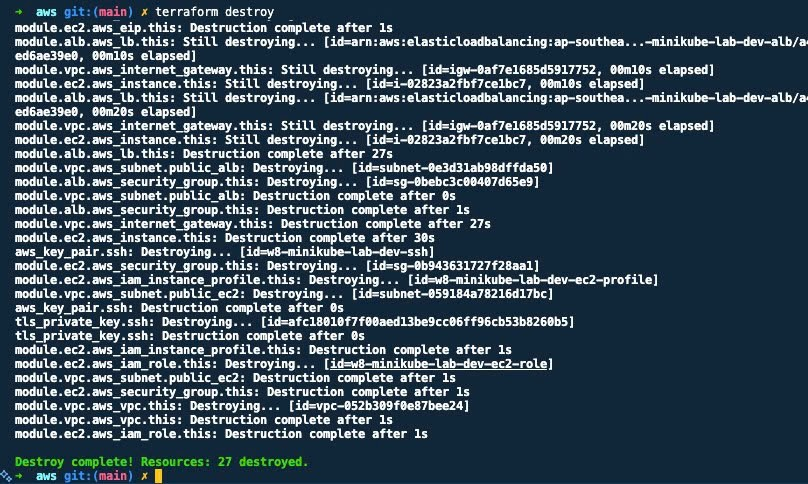

# Evidence

Folder này là phần "nói có sách, mách có ảnh" cho `W8 Project`.

Mục tiêu của bộ evidence không chỉ là cho thấy lab chạy được, mà còn chứng minh đúng các ý người chấm cần:

- App mở được từ URL của `ALB`
- App thật sự chạy trong `Kubernetes`
- Hạ tầng được dựng bằng `Terraform`
- Sau khi demo xong có thể `destroy` sạch

## Cách đọc bộ ảnh

Thứ tự hợp lý nhất để trình bày là:

1. `applyOutput.png`
2. `home.png`
3. `deployment.png`
4. `pods.png`
5. `service.png`
6. `destroy.png`

Đi theo thứ tự này thì câu chuyện rất rõ:

`Terraform dựng hạ tầng -> ALB mở được app -> app nằm trong K8s -> traffic đi qua Service -> cuối cùng dọn sạch`

## Giải thích từng ảnh

### 1. Apply Output

- File: `images/applyOutput.png`
- Ảnh này cho thấy `terraform apply` đã chạy xong và trả ra output cần thiết.
- Điểm quan trọng nhất là phải nhìn thấy được các output như `alb_dns_name`, `ec2_public_ip`, `ssh_command`.
- Đây là bằng chứng cho việc hạ tầng không dựng tay, mà được tạo từ Terraform config.

Câu ngắn để nói khi demo:

`Đây là output sau apply, tức toàn bộ VPC, EC2, ALB và phần bootstrap đã được Terraform dựng xong.`

### 2. Home

- File: `images/home.png`
- Ảnh này là cú chốt phần frontend: mở URL từ `alb_dns_name` trên browser và app trả về trang thành công.
- Nó chứng minh acceptance quan trọng nhất: từ hạ tầng vừa dựng lên, người dùng ngoài internet truy cập được app qua `ALB`.

Câu ngắn để nói khi demo:

`Ảnh này chứng minh URL của ALB hoạt động và request đã đi xuyên qua hạ tầng tới ứng dụng.`

### 3. Deployment

- File: `images/deployment.png`
- Ảnh này cho thấy trong namespace `w8-demo` có `Deployment` của ứng dụng.
- Điểm cần nhấn là app đang được quản lý bởi Kubernetes object, không phải chỉ chạy bằng `node server.js` trên EC2.

Câu ngắn để nói khi demo:

`Ở đây ứng dụng được deploy dưới dạng Kubernetes Deployment, tức là đang chạy trong cluster minikube.`

### 4. Pods

- File: `images/pods.png`
- Ảnh này là bằng chứng trực diện nhất cho việc app đang chạy trong K8s.
- Nếu nhìn thấy nhiều pod `Running`, đặc biệt là đủ số replicas mong muốn, thì đây là dấu hiệu hệ workload đã lên đầy đủ.
- Ảnh này giúp trả lời rất nhanh câu hỏi: `Có chắc app không chạy thẳng trên EC2 không?`

Câu ngắn để nói khi demo:

`Các pod đang ở trạng thái Running, nên app thực sự đang chạy trong Kubernetes chứ không phải cài trực tiếp trên máy EC2.`

### 5. Service

- File: `images/service.png`
- Ảnh này nối phần kỹ thuật mạng lại với nhau.
- Nó cho thấy app được expose bằng `Service` kiểu `NodePort`, chính là điểm mà `ALB` forward traffic vào.
- Nói cách khác, đây là mắt xích giải thích đường đi `ALB -> EC2:30080 -> Service -> Pods`.

Câu ngắn để nói khi demo:

`Service NodePort là cầu nối giữa ALB bên ngoài và các pod bên trong cluster.`

### 6. Destroy

- File: `images/destroy.png`
- Ảnh này chứng minh bài làm không chỉ dựng được mà còn dọn được.
- Đây là phần nhiều người hay quên, nhưng lại rất quan trọng vì rubric có yêu cầu cleanup sạch sau khi xong.

Câu ngắn để nói khi demo:

`Sau khi hoàn tất kiểm tra, mình destroy lại toàn bộ để chứng minh hạ tầng này có thể quản lý vòng đời trọn vẹn bằng Terraform.`

## Mapping Với Acceptance

`1 lệnh từ repo sạch -> app chạy, URL ALB trả về trang app`

- Chứng minh bằng `applyOutput.png` và `home.png`

`App thực sự chạy trong K8s, không phải cài thẳng EC2`

- Chứng minh bằng `deployment.png`, `pods.png`, `service.png`

`Có >=2 provider được wire trong cùng cấu hình`

- Chứng minh bằng code trong `infra/aws`, hiện đang wire `aws`, `tls`, `local`, `cloudinit`

`Giải thích được vì sao chọn cách làm đó`

- Chứng minh bằng phần `Provider Wiring` trong [README.md](/Users/ductiennguyen/Documents/Project/xbrain/NguyenDucTien-aws-accelerator-p2/cloud/W8/W8-project/README.md:1)

`Dọn được sạch sau khi xong`

- Chứng minh bằng `destroy.png`
