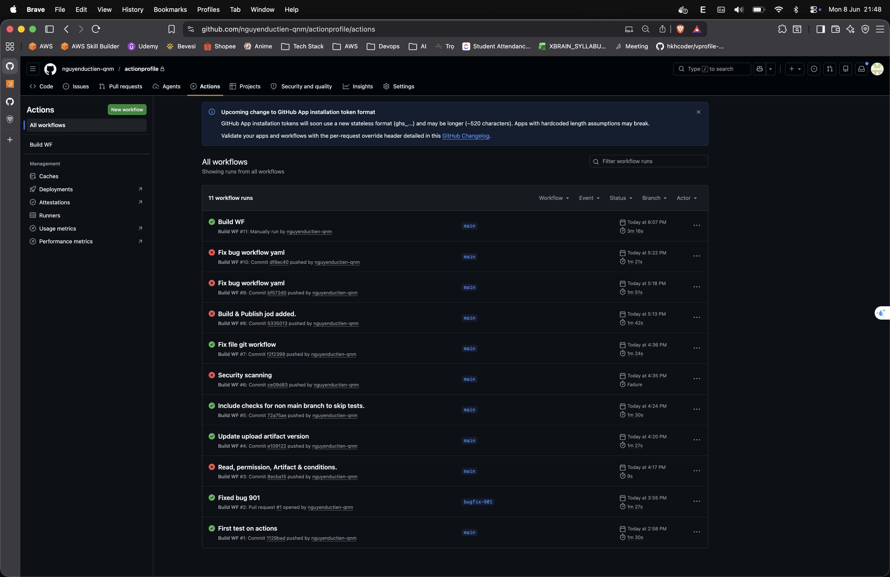

# GitHub Actions

- GitHub Actions dùng để tự động hóa quy trình trong repository như `build`, `test`, `lint`, `release`, `deploy`.
- Workflow sẽ chạy khi có một sự kiện xảy ra, ví dụ `push`, `pull_request`, `workflow_dispatch`, `schedule`.
- File workflow thường nằm trong thư mục `.github/workflows/*.yml`.

## Thành phần chính

- `workflow`: toàn bộ pipeline được định nghĩa trong một file YAML.
- `on`: khai báo sự kiện nào sẽ kích hoạt workflow.
- `jobs`: tập hợp các công việc cần chạy.
- `steps`: các bước cụ thể bên trong job.
- `uses`: gọi một action có sẵn từ GitHub Marketplace hoặc action nội bộ.
- `run`: chạy shell command trực tiếp.
- `runs-on`: máy thực thi job, ví dụ `ubuntu-latest`, `windows-latest`, `macos-latest`.

## Luồng chạy cơ bản

1. Có event phát sinh trên repo.
2. GitHub đọc file workflow tương ứng trong `.github/workflows/`.
3. Các `jobs` được chạy song song mặc định nếu không có phụ thuộc.
4. Nếu cần job chạy theo thứ tự, dùng `needs`.
5. Kết quả có thể tạo artifact, publish image, tạo release hoặc triển khai tiếp.

## Ví dụ workflow tối thiểu

```yaml
name: ci

on:
  push:
    branches: [main]
  pull_request:

jobs:
  test:
    runs-on: ubuntu-latest
    steps:
      - name: Checkout source
        uses: actions/checkout@v4

      - name: Setup Node.js
        uses: actions/setup-node@v4
        with:
          node-version: 20

      - name: Install dependencies
        run: npm ci

      - name: Run tests
        run: npm test
```

## Lab evidence



## Các khái niệm hay dùng

- `env`: khai báo biến môi trường ở mức workflow, job hoặc step.
- `vars`: chứa biến cấu hình không nhạy cảm ở mức repo hoặc organization.
- `secrets`: chứa thông tin nhạy cảm như token, password, access key.
- `matrix`: chạy cùng một job với nhiều version hoặc nhiều môi trường khác nhau.
- `if`: thêm điều kiện để quyết định job hoặc step có chạy hay không.
- `artifacts`: lưu file build, report test, binary để tải lại sau workflow.
- `cache`: tăng tốc build bằng cách lưu dependency hoặc build cache.

## Ví dụ dùng `needs` và `secrets`

```yaml
name: build-and-push

on:
  push:
    branches: [main]

jobs:
  test:
    runs-on: ubuntu-latest
    steps:
      - uses: actions/checkout@v4
      - run: echo "run test here"

  docker:
    runs-on: ubuntu-latest
    needs: test
    steps:
      - uses: actions/checkout@v4

      - name: Login to registry
        uses: docker/login-action@v3
        with:
          username: ${{ secrets.DOCKER_USERNAME }}
          password: ${{ secrets.DOCKER_PASSWORD }}

      - name: Build image
        run: docker build -t my-app:${{ github.sha }} .
```

## Pattern plan-on-PR, apply-on-merge

- Đây là pattern rất hay dùng trong CI/CD, nhất là với Terraform hoặc deploy hạ tầng.
- Khi có `pull_request`:
  - chạy `lint`, `test`, `validate`, `plan`
  - chỉ kiểm tra và hiển thị thay đổi dự kiến
  - không apply thật
- Khi PR được merge vào `main`:
  - workflow chạy lại trên `push`
  - lúc này mới `apply` hoặc deploy thật

## Vì sao tách như vậy

- An toàn hơn vì review được thay đổi trước khi áp dụng.
- Giảm rủi ro ai đó apply nhầm từ branch cá nhân.
- Phù hợp với quy trình review code và approval.

## Ví dụ luồng Terraform

```yaml
on:
  pull_request:
  push:
    branches: [main]

jobs:
  plan:
    if: github.event_name == 'pull_request'
    runs-on: ubuntu-latest
    steps:
      - run: terraform plan

  apply:
    if: github.event_name == 'push' && github.ref == 'refs/heads/main'
    runs-on: ubuntu-latest
    steps:
      - run: terraform apply -auto-approve
```

## Liên hệ với GitOps

- Nếu đang dùng GitOps với Argo CD hoặc Flux thì GitHub Actions thường không `kubectl apply` trực tiếp vào cluster.
- Cách phù hợp hơn là:
  - build và push Docker image.
  - cập nhật tag image trong repo manifest hoặc Helm values.
  - commit thay đổi đó lên git.
  - Argo CD hoặc Flux sẽ tự đồng bộ trạng thái xuống cluster.
- Cách này giúp lịch sử triển khai nằm trong git, dễ audit và rollback hơn.

## Best practices

- Tách `CI` và `CD` thành workflow riêng nếu quy trình lớn.
- Chỉ cấp quyền tối thiểu cần thiết cho `GITHUB_TOKEN`.
- Không hard-code secret trong file workflow.
- Pin version action rõ ràng, ví dụ `actions/checkout@v4`.
- Dùng `branches`, `paths`, `tags` để tránh chạy workflow không cần thiết.
- Bật cache cho package manager để giảm thời gian build.
- Thêm bước `lint`, `test`, `security scan` trước khi deploy.

## Hạn chế và lưu ý

- GitHub-hosted runner là máy tạm thời, chạy xong sẽ bị hủy.
- Mỗi job là môi trường riêng, không tự chia sẻ file với job khác nếu không dùng artifact/cache.
- Workflow lỗi ở giữa chừng không tự rollback hạ tầng hoặc deployment; rollback phải được thiết kế riêng.
- Nếu deploy production, nên thêm `environment` và approval để kiểm soát phát hành.
