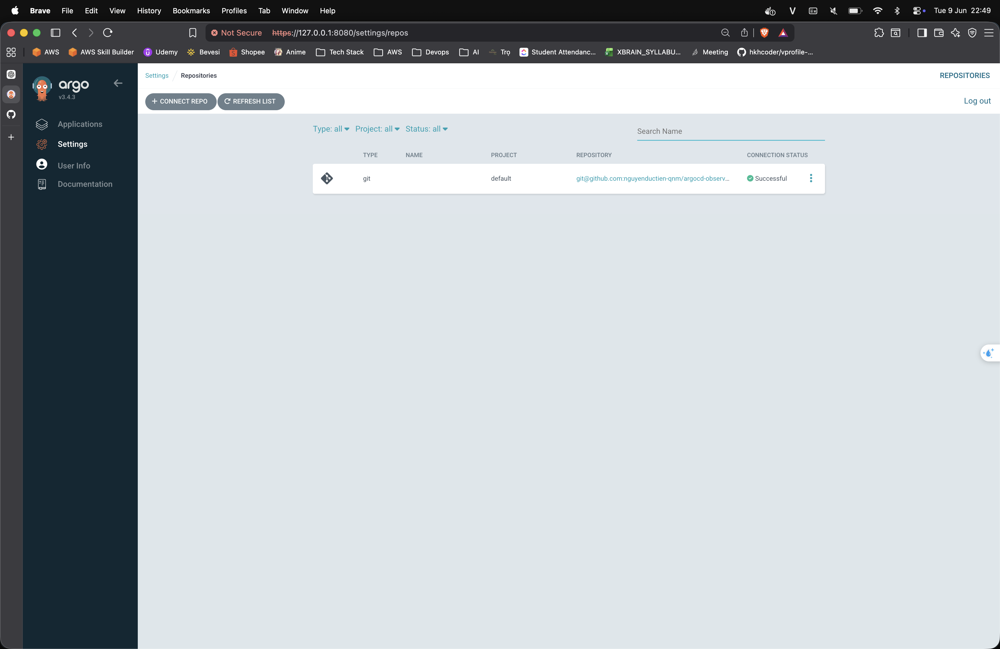
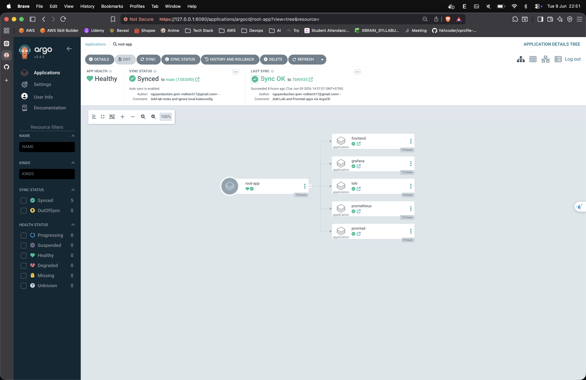
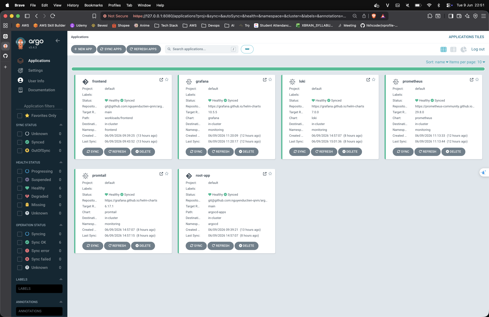
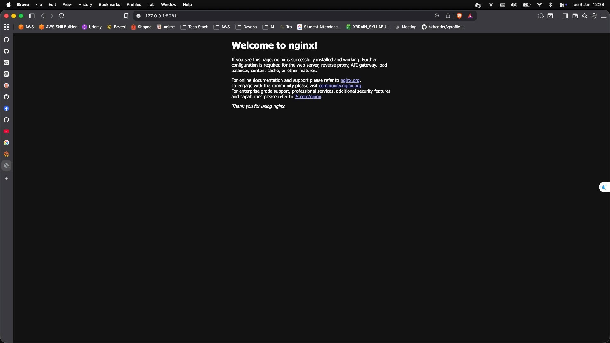
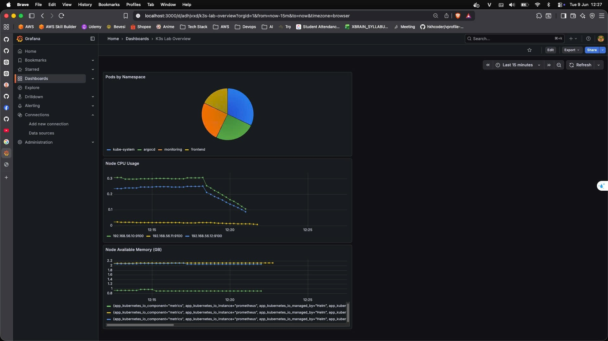
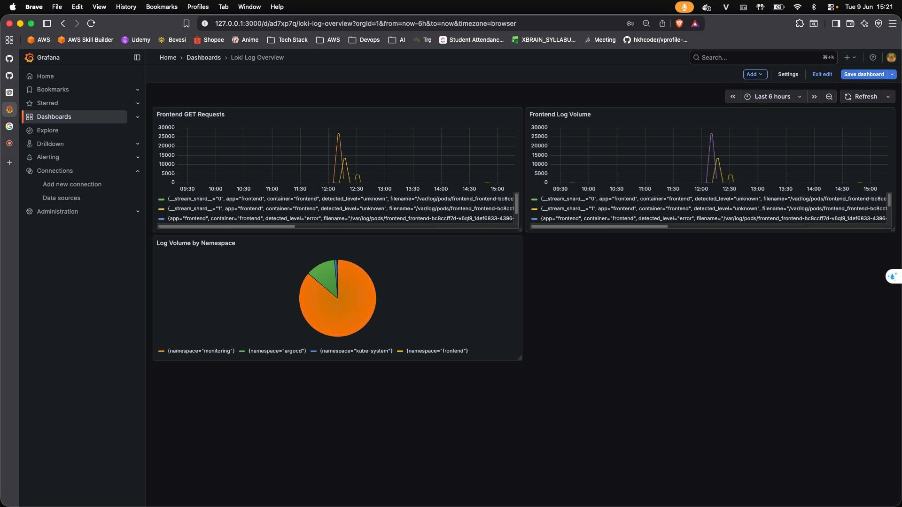
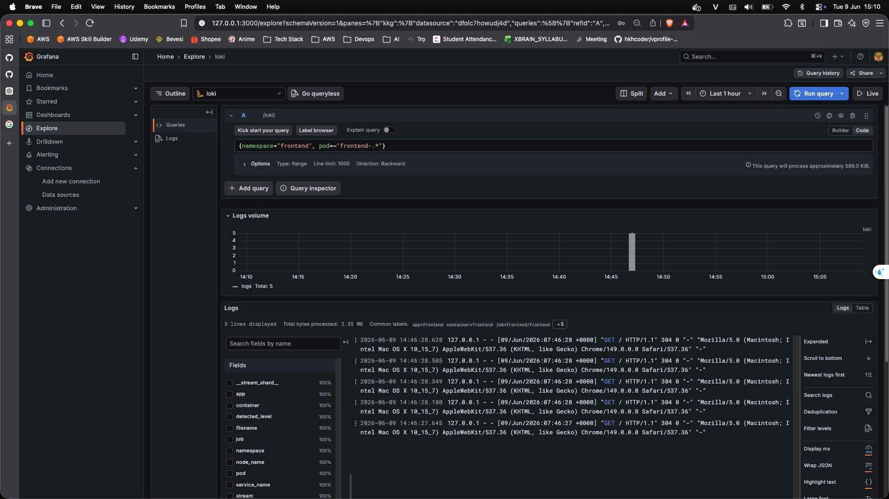

# K3s + ArgoCD + Observability Lab Notes

## 1. Final architecture

```text
GitHub
  -> ArgoCD
  -> K3s
     -> frontend
     -> Prometheus
     -> Grafana
     -> Loki
     -> Promtail
```

## 2. What each component does

- `K3s`: Kubernetes cluster chạy workload.
- `ArgoCD`: theo dõi Git repo và sync manifest/chart xuống cluster.
- `frontend`: app lab để test GitOps và sinh traffic/log.
- `Prometheus`: scrape và lưu metrics.
- `Grafana`: query Prometheus/Loki và hiển thị dashboard.
- `Loki`: lưu và query logs.
- `Promtail`: đọc log container trên node và gửi vào Loki.

## 3. GitOps flow

```text
Edit YAML
  -> git commit
  -> git push
  -> ArgoCD detect change
  -> ArgoCD sync
  -> Cluster state changes
```

Điểm đã verify:

- bootstrap `root-app`
- `root-app` tạo app con
- `frontend` deploy qua GitOps
- scale `replicas: 2 -> 5` chỉ bằng Git push, không dùng `kubectl apply`

## 4. App of Apps mindset

- `root-app` quản lý thư mục `argocd-apps/`
- mỗi file trong `argocd-apps/` là một `ArgoCD Application`
- mỗi app con quản lý workload hoặc Helm chart riêng

Ví dụ:

```text
root-app
  -> frontend app
  -> prometheus app
  -> grafana app
  -> loki app
  -> promtail app
```

## 5. Kubernetes resource chain

```text
Deployment
  -> ReplicaSet
  -> Pods

Service
  -> chọn Pod qua labels
```

Ý nghĩa:

- `Deployment`: mong muốn chạy bao nhiêu replica
- `ReplicaSet`: giữ đủ số pod
- `Pod`: workload chạy thật
- `Service`: route traffic vào pod

## 6. Metrics pipeline

```text
Kubernetes / exporters
  -> Prometheus scrape
  -> Prometheus store metrics
  -> Grafana query Prometheus
  -> Dashboard / Explore
```

Đã test:

- query `up`
- query CPU / memory / pod count
- tự tạo dashboard metrics

## 7. Logs pipeline

```text
Container logs
  -> Promtail
  -> Loki
  -> Grafana Explore / dashboard
```

Đã test:

- query `{namespace="frontend"}`
- thấy nginx access log của frontend
- tạo dashboard Loki cơ bản

## 8. Useful PromQL

Pods by namespace:

```promql
count by (namespace) (kube_pod_info)
```

Node available memory in GB:

```promql
node_memory_MemAvailable_bytes / 1024 / 1024 / 1024
```

Node CPU usage by instance:

```promql
sum by (instance) (rate(node_cpu_seconds_total{mode!="idle"}[5m]))
```

## 9. Useful LogQL

Frontend logs:

```logql
{namespace="frontend"}
```

Frontend GET requests:

```logql
count_over_time({namespace="frontend"} |= "GET"[5m])
```

Log volume by namespace:

```logql
sum by (namespace) (count_over_time({namespace=~".+"}[5m]))
```

## 10. Key troubleshooting lessons

### ArgoCD repo connect failed

Dependency chain:

```text
ArgoCD UI
  -> argocd-server
  -> argocd-repo-server
  -> CoreDNS / cluster DNS
  -> Internet access
  -> GitHub
  -> SSH trust
  -> SSH auth
  -> private repo
```

Root cause found:

- cluster DNS forward của CoreDNS đang trỏ vào `/etc/resolv.conf`
- Ubuntu dùng `127.0.0.53` (`systemd-resolved`)
- repo-server không resolve được `github.com`

Fix:

- sửa CoreDNS `forward . /etc/resolv.conf`
- đổi thành public DNS upstream

### Prometheus stack too complex for lab

`kube-prometheus-stack` gây thêm complexity:

- CRD
- Prometheus Operator
- admission webhook
- TLS/certificate
- finalizer stuck delete

Lesson:

- với lab học flow, chọn chart đơn giản trước
- không nhất thiết dùng stack production-oriented ngay từ đầu

### Stuck deleting ArgoCD application

Nếu app có:

- `deletionTimestamp`
- finalizer
- operation vẫn `Running`

thì app có thể bị stuck delete.

Case đã gặp:

- app `prometheus` stuck vì finalizer
- phải patch bỏ finalizer để gỡ app ra khỏi trạng thái treo

## 11. Observability mindset

- `Prometheus` = metrics backend
- `Grafana` = visualization layer
- `Loki` = logs backend
- `Promtail` = log shipper

Một câu dễ nhớ:

```text
Prometheus hỏi metrics
Promtail đẩy logs
```

## 12. Lab Evidence

### 12.1. ArgoCD connected to Git repository

Link: [argocd-repository-connected.png](image/argocd-repository-connected.png)



Mô tả:
- Ảnh này chứng minh ArgoCD đã connect thành công tới Git repository bằng SSH.
- Trạng thái `Connection Status: Successful` là điều kiện để GitOps sync hoạt động.

### 12.2. Root app manages child applications

Link: [argocd-root-app-tree.png](image/argocd-root-app-tree.png)



Mô tả:
- Ảnh này chứng minh mô hình `App of Apps` đã hoạt động.
- `root-app` đang quản lý các app con: `frontend`, `prometheus`, `grafana`, `loki`, `promtail`.

### 12.3. All ArgoCD applications are healthy

Link: [argocd-applications-healthy.png](image/argocd-applications-healthy.png)



Mô tả:
- Ảnh này cho thấy toàn bộ app chính đều ở trạng thái `Healthy` và `Synced`.
- Đây là bằng chứng rằng cả GitOps layer và workload layer đều đang ổn định.

### 12.4. Frontend is reachable

Link: [frontend-nginx-homepage.png](image/frontend-nginx-homepage.png)



Mô tả:
- Ảnh này chứng minh service `frontend` đã truy cập được qua `port-forward`.
- Trang mặc định của nginx xác nhận workload frontend đã chạy thành công trong cluster.

### 12.5. Metrics dashboard works in Grafana

Link: [grafana-k3s-lab-overview-dashboard.png](image/grafana-k3s-lab-overview-dashboard.png)



Mô tả:
- Ảnh này chứng minh Grafana đã query được Prometheus.
- Dashboard `K3s Lab Overview` hiển thị các panel metrics cơ bản:
  - `Pods by Namespace`
  - `Node CPU Usage`
  - `Node Available Memory (GB)`

### 12.6. Loki log dashboard works

Link: [grafana-loki-log-overview-dashboard.png](image/grafana-loki-log-overview-dashboard.png)



Mô tả:
- Ảnh này chứng minh Grafana đã query được Loki và render được dashboard logs.
- Dashboard `Loki Log Overview` cho thấy log volume theo namespace và activity của `frontend`.

### 12.7. Frontend logs are searchable in Grafana Explore

Link: [grafana-loki-frontend-logs-explore.png](image/grafana-loki-frontend-logs-explore.png)



Mô tả:
- Ảnh này chứng minh pipeline logs đã hoàn chỉnh:

```text
frontend container logs
  -> Promtail
  -> Loki
  -> Grafana Explore
```

- Query `{namespace="frontend", pod=~"frontend-.*"}` trả về nginx access logs thật của ứng dụng frontend.
